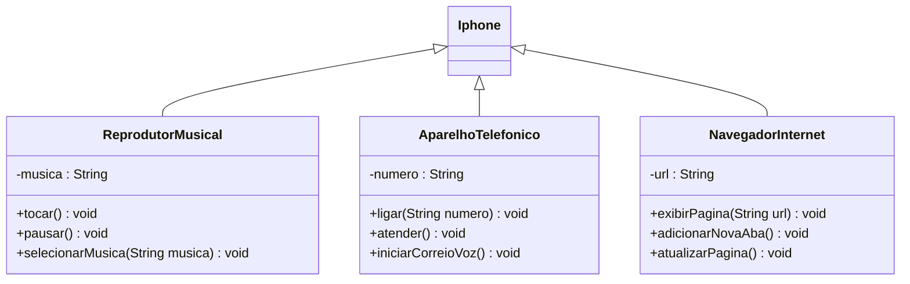

UML_IPHONE

```mermaid
classDiagram
    Iphone <|-- ReprodutorMusical
    Iphone <|-- AparelhoTelefonico
    Iphone <|-- NavegadorInternet
    class ReprodutorMusical{
      -musica : String
      +tocar()void
      +pausar()void
      +selecionarMusica(String musica)void

    }
    class AparelhoTelefonico{
      -numero : String
      +ligar(String numero)void
      +atender()void
      +iniciarCorreioVoz()void
    }
    class NavegadorInternet{
      -url : String
      +exibirPagina(String url)void
      +adicionarNovaAba()void
      +atualizarPagina()void
    }

```
