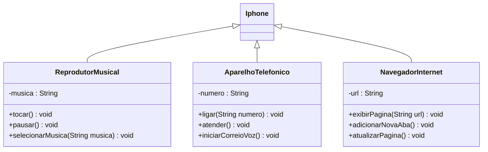

# Desafio UML IPHONE
Instruções apresentadas sobre o Desafio DIO de Java Básico disponível no link [DIO - Trilha Java Básico](https://github.com/digitalinnovationone/trilha-java-basico/tree/main/desafios/poo)

## O que fazer
Neste desafio, você será responsável por modelar e diagramar a representação UML do componente iPhone, abrangendo suas funcionalidades como Reprodutor Musical, Aparelho Telefônico e Navegador na Internet.

## Regras básicas

1. Reprodutor Musical.
    - Métodos: <code>tocar()</code>, <code>pausar()</code>, <code>selecionarMusica(String musica)</code>
2. Aparelho Telefônico
    - Métodos: <code>ligar(String numero)</code>, <code>atender()</code>, <code>iniciarCorreioVoz()</code>
3. Navegador na Internet
    - Métodos: <code>exibirPagina(String url)</code>, <code>adicionarNovaAba()</code>, <code>atualizarPagina()</code>

